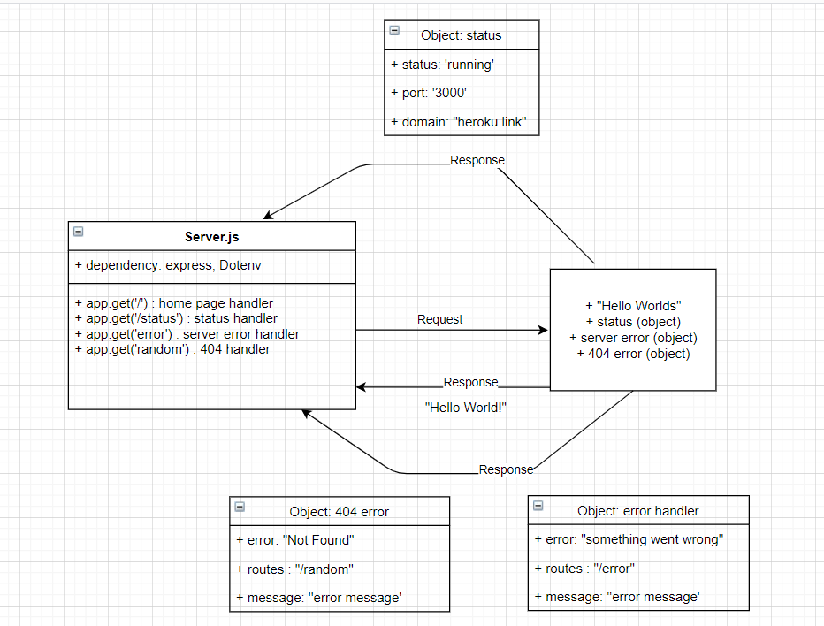

# Class 01- Lab01
# Server Deployment Practice
## Deployment Test
### Author: Boshra Jaber
* [tests report](https://github.com/BoshraJaber/server-deployment-practice/actions)
* [Heroku application for main branch](https://boshra-server-deploy-prod.herokuapp.com/)
* [Heroku application for dev branch](https://boshra-server-deploy-dev.herokuapp.com/)

## Setup
- `.env` requirements:
 * PORT - 3000
- Install Required Packages:
  * `npm i express dotenv`
  * `npm i -d jest supertest eslint`
  * `npm i -g nodemon`
- Running the app
 * `npm start`
 1. Endpoint: `/status`
   * Returns Object:
  ```
  {
   "domain": "john-api-server.demo.herokuapp.com",
   "status": "running",
   "port": 42123
  }
  ```
 2. Endpoint: `/`
   * Returns  Hello World!
 3. Endpoint: `/error`
   * Returns Object:
  ```
  {
   "error": "Something went wrong!",
   "route": "/error",
   "message": "Error with the server"
   }
  ```
 4. Endpoint: `/random`
   * Returns Object:
  ```
  {
   "error": 404,
   "route": "/",
   "message": "Not Found"
   }
  ```
- In package.json file add:
  ```
  "scripts": {
    "start": "node index.js",
    "dev": "nodemon",
    "test": "jest --coverage --verbose ",
    "lint": "eslint '**/*.js'"
  }
  ```

## Tests
Unit Tests: `npm run test`
Lint Tests: `npm run lint`

## UML:
Here is a UML of my code: 

